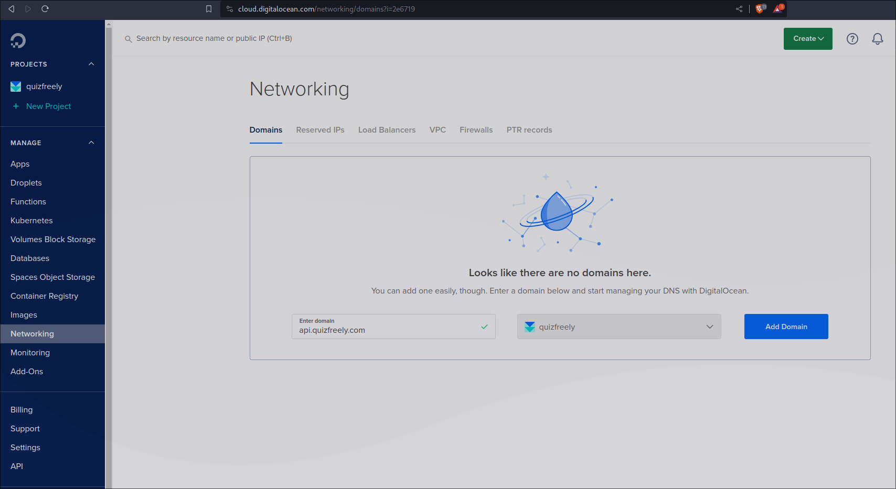
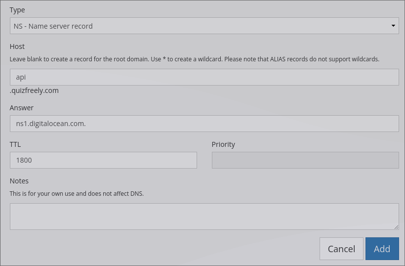

# Quizfreely's Backend

We use pocketbase. It's self-hosted

## Setup

The below instructions are for setting up quizfreely's "real" pocketbase instance.

As of right now we use digitalocean.

### Droplet Setup

First, create a "droplet", with:
- shared cpu > basic > regular + disk type: ssd
  - 1GB/1cpu or 2GB/1cpu
  - 25GB SSD Disk or 50GB SSD Disk
  - 1000GB transfer or 2TB transfer
- any linux distro
  - with hostname "quizfreelybackend"

With all those settings it should be around 6 USD to 12 USD per month

### DNS Setup

Under digitalocean's homepage, go to "networking". (NOT home > droplet > networking, it's home > networking, there's a difference)

Under "networking", go to "domains", and add `api.quizfreely.com`



after clicking "add domain", create a new `A` reccord, with:
- hostname: `@`
- "will direct to": dropdown/"select resource" > the-droplet-name/"quizfreelybackend"
- TTL: i prefer 600 seconds
  - but its not super important tbh

After we add that record, look at the list of records.


Copy those `NS` records' values, and add those same records to quizfreely.com's actual domain registar's DNS records.



This makes our domain registar's DNS records point to digitalocean's DNS records & nameservers for `api.quizfreely.com`, while still using our domain registar's nameservers for `quizfreely.com`, and its other subdomains.

### Download Pocketbase

In the droplet, create `/root/pb/`

Download pocketbase's linux executable, then move it to `/root/pb/pocketbase`.

We can find the latest download url/link in [pocketbase's github relases](https://github.com/pocketbase/pocketbase/releases) or somewhere in [pocketbase's website](https://pocketbase.io) or docs. The version in the url/link below is just an example

Use curl to download it in the droplet, for example:
```
# cd /root
# curl https://github.com/pocketbase/pocketbase/releases/download/v1234/pocketbase_1234_linux_amd64.zip -L -o /root/pocketbase.zip
```

The `-L` and `-o pocketbase.zip` options above are important.

Extract it using `unzip`
```
# apt install unzip
# unzip /root/pocketbase.zip -d /root/pocketbasezip
```

Now, we will have a folder named `pocketbasezip`, which has the contents of the zip file!

Delete the zip file (we don't need it anymore), move `/root/pocketbasezip/pocketbase` to `/root/pb/pocketbase`, and then delete `/root/pocketbasezip/` and its contents.
```
# rm /root/pocketbase.zip
# mv /root/pocketbasezip/pocketbase /root/pb/pocketbase
# rm -r /root/pocketbasezip/
```

Now we are left with pocketbase's executable, at `/root/pb/pocketbase`

### Pocketbase System Service

Under `/etc/systemd/system/`, create `/etc/systemd/system/pocketbase.service`.

Then copy `backend/etc/systemd/system/pocketbase.serivce` from Quizfreely's source code. (Copy the entire file's contents)

Edit `/etc/systemd/system/pocketbase.service` on the droplet, using `vi`
```
# vi /etc/systemd/system/pocketbase.service
```

Paste the contents from our clipboard.

`Control V` might not work, so: In digitalocean's web console, we can paste through our browsers right-click menu. (It should paste multi-line selections properly btw)

Save the file, and then enable the service.
```
systemctl enable pocketbase.service
```

Finally, start pocketbase!
```
systemctl start pocketbase
```
