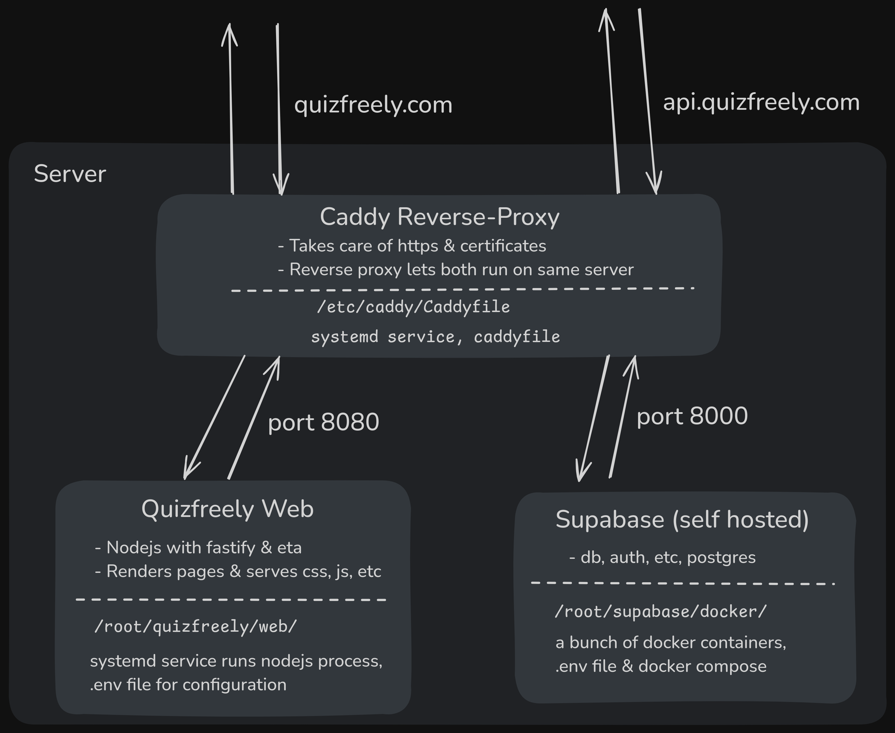

# Production Overview - Dev/Contributor Docs

Quizfreely's website, https://quizfreely.com and supabase instance, https://api.quizfreely.com, run on the same server/droplet.

We use a caddy reverse proxy with supabase on port 8000 and the website nodejs process on port 8080, the reverse proxy lets us serve both domains with valid https from the same server/droplet.

Supabase uses docker, caddy has a systemd service, and quizfreely's web nodejs process has a systemd service.

## Droplet Specs

Right now our digitalocean droplet has:
- Debian 12 x64
- 2GB memory
- 1 vCPU
- 50GB storage SSD

With those specs, we usually have:
- 30% cpu usage
- 85% memory usage
- 15% disk usage

## Setup/Maintenance Instructions

For Quizfreely's web nodejs server, see [web-setup.md](./web-setup.md)
